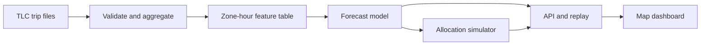

# FleetScope: NYC Taxi Demand Forecasting & Fleet Planning

**Project type:** End-to-end applied ML portfolio project

**Primary audience:** AI/ML, data science, analytics, and consulting internship reviewers

**Status:** Revised specification; implementation started. The starter benchmark is separate from the final portfolio evaluation.

## 1. Project in one paragraph

Build a map-first application that forecasts the number of **recorded yellow-taxi pickups in each NYC taxi zone for the next hour**. In a historical replay, the user can advance the clock, inspect predicted and recorded pickups, see where the model performs poorly, and test how a limited *simulated* fleet could be distributed across zones. The finished project should combine reproducible data preparation, honest time-based ML evaluation, an API, an interactive map, and an explicitly assumption-based decision simulator.

> **Portfolio pitch:** “I built a zone-level taxi pickup forecasting system with an interactive NYC map and a fleet allocation simulator. I compared it against seasonal baselines on future months and measured how its recommendations behave under a limited vehicle budget.”

## 2. The question and the honest scope

At the end of an hour, estimate the number of pickups in each taxi zone during the **following** hour. For example, after the 16:00–17:00 interval is complete, forecast recorded pickups from 17:00–18:00 using only information available by 17:00.

The target is **completed, recorded pickups**, not all people who tried to get a taxi. Public TLC trip records do not provide complete unsatisfied request counts, the position of every available taxi at every instant, or the counterfactual outcome of moving a vehicle. Therefore:

- Call the model output a *pickup forecast* rather than a measurement of true latent demand.
- Call suggested vehicle moves a *simulation* based on an assumed available fleet and starting positions.
- Do not claim real-world revenue gained, rides saved, or unmet demand eliminated from this dataset alone.
- Do not market the replay as a live operational feed. TLC publishes these public files monthly, typically after a delay.

### Replay information availability

The replay assumes access to a **hypothetical hourly pickup feed**; public TLC records provide the historical observations. Public files are typically released about two months later, so event time is not the same as public availability time. At prediction time `t`, the zero-delay experiment may use completed intervals ending at or before `t`. Repeat the experiment with one- and two-hour observation delays; apply the delay consistently to all recent-history features and policies. Record the delay in each experiment and API response.

## 3. Data and unit of analysis

**Source:** [NYC TLC Trip Record Data](https://www.nyc.gov/site/tlc/about/tlc-trip-record-data.page). Start with yellow taxi records only to keep the service definition consistent. Use the TLC's [yellow trip data dictionary](https://www.nyc.gov/assets/tlc/downloads/pdf/data_dictionary_trip_records_yellow.pdf), taxi zone lookup table, and taxi zone shapefile linked on the same data page.

| Item | Choice |
| --- | --- |
| Raw fields required | `tpep_pickup_datetime`, `PULocationID`; optionally `tpep_dropoff_datetime` and `DOLocationID` for descriptive trip flows |
| Prediction row | One taxi zone × one hourly interval |
| Target | Number of yellow-taxi trips with a pickup recorded in that zone and interval |
| First working sample | A few consecutive months to validate ingestion and interface |
| Final evaluation sample | Prefer enough history for held-out forecast windows spanning a full year; a year of total data alone does not demonstrate performance across all seasons |
| Geography | Official TLC taxi zone polygons, joined by location ID |

Build a complete zone-hour grid, including intervals with **zero** recorded pickups. Validate timestamps and zone IDs; document removed or corrected records. Interpret time in the `America/New_York` time zone and handle daylight saving transitions explicitly. Keep the raw files immutable and save cleaned hourly aggregates separately. Avoid mixing yellow, green, and for-hire trips unless the project scope is formally expanded.

### Data completeness and timestamp contract

- Create zero counts only after every expected monthly file has been downloaded, checksum-verified, schema-validated, and processed successfully. A missing file or failed batch is an error, never an empty month.
- Preserve source URLs, SHA-256 checksums, byte counts, retrieval dates, accepted counts, and mutually exclusive rejection counts in a manifest and quality report. File completeness does not prove that vendors reported every trip.
- Define the modeled geography as TLC polygons within the five NYC boroughs. Report unknown IDs, outside-NYC locations, and IDs without usable geometry separately from modeled pickups.
- Store resolved hour keys in UTC; derive calendar features and display times in `America/New_York`. Never guess which occurrence a naive timestamp belongs to during the repeated autumn hour. Quarantine ambiguous and nonexistent local timestamps; mark the two repeated autumn hours unavailable rather than zero. Document resulting gaps and metric exclusions.
- Define the seasonal naive baseline as the same local weekday/hour in the previous week. It normally corresponds to 168 elapsed hours, but differs across daylight saving transitions. If the local reference is ambiguous or missing, treat that prediction as unavailable.

### Example aggregate table

| `hour_start` | `pickup_zone_id` | `pickup_count` |
| --- | ---: | ---: |
| `2025-06-10T16:00:00-04:00` | `...` | `...` |

The ellipses above represent values to calculate from the actual dataset; no results are assumed in this plan.

## 4. Features and leakage rules

Start with features that can be reproduced identically during training and a historical replay:

- Calendar: hour of day, day of week, weekend flag, month, and known holidays.
- Recent history: zone pickups in prior **completed** hours, such as lags of 1, 2, 24, and 168 hours.
- History summaries: rolling averages or medians over completed past intervals; shift each rolling window so it cannot include the target hour.
- Location: pickup zone ID and possibly borough or a coarser location grouping.
- Optional later: forecast weather that would have been available at the actual decision time. Historical observed weather for a future hour is not a valid input to a real-time forecast.

Create the split **before** fitting transformations or tuning. The training pipeline, batch evaluator, API, and replay must share the same feature definitions. Include a small automated test asserting that changing pickup counts *after* the prediction timestamp cannot change that prediction's input features.

## 5. Modeling and evaluation

### Baselines first

1. **Same hour last week:** predict using the same local weekday/hour in the previous week, with the daylight saving policy above.
2. **Historical seasonal average:** mean or median for the zone × weekday × hour, computed only from earlier data.
3. **Optional simple model:** regularized regression or a count model.

Then train a **global LightGBM or XGBoost model** across zones using lag, calendar, and zone features. Compare a standard regression objective against an appropriate nonnegative/count-oriented objective if useful. Deep sequence models are a stretch goal, not the initial requirement.

### Time-based test design

- Use consecutive earlier months for training, a later period for model and feature selection, and an **untouched final future period** for reporting.
- Repeat evaluation over several rolling forecast origins or contiguous future windows if data volume permits.
- Compute every prediction at a defined prediction timestamp using only past inputs.
- Preserve the same actual observations for every baseline and model comparison.
- If weather is added, retain a separate experiment without it so the value of that dependency is measurable.

### Frozen starter protocol and final evaluation

The first implementation uses yellow-taxi files for January through March 2025. Training target hours run from `2025-01-08T00:00:00-05:00` to (excluding) `2025-03-01T00:00:00-05:00`; validation runs to (excluding) `2025-03-15T00:00:00-04:00`; test runs to (excluding) `2025-04-01T00:00:00-04:00`. The first week provides lag warm-up. Models and the seasonal-average baseline are fitted only on training targets and frozen throughout validation and test. Earlier completed observations within validation/test may update lag features under the stated feed assumption. Hyperparameters and the forecast model used in the demo are selected using validation only. All intervals are half-open.

Split unique target timestamps and then assign all zones for an hour together. Never split arbitrary zone-hour row positions. Record split dates, fitting cutoff, retraining rule, observation delay, random seed, feature list, package versions, and source-code fingerprint in each run. Evaluate every comparator on the same eligible rows and report exclusions. Treat the Q1 result as a starter benchmark, not evidence of full seasonal generalization. Freeze a separate final evaluation protocol before expanding the portfolio claims.

### Evidence of model contribution

- Run feature ablations: calendar/location only; add recent history; then add weekly history. Use the same target rows and training budget.
- Report relative MAE improvement against the strongest baseline selected on validation, and performance by contiguous future window. Include training-defined zone-volume groups.
- Evaluate forecast errors separately from allocation outcomes; improved MAE does not guarantee improved simulated coverage.
- Add calibrated prediction intervals as an early follow-on only when coverage and width can also be evaluated; do not label an unvalidated range a confidence interval.

| Measure | Why it belongs |
| --- | --- |
| MAE, in pickups per zone-hour | The most interpretable average error |
| WAPE or another volume-aware aggregate | Gives a citywide perspective; report its numerator and denominator |
| Error by borough, zone-volume group, hour, and weekday | Finds blind spots hidden by a citywide average |
| Rush-hour and holiday performance | Tests difficult operational periods |
| Optional prediction-interval coverage and width | Shows when a forecast is uncertain |

Avoid using MAPE as the sole metric because zone-hours with zero pickups make it unstable or undefined. A strong result is not a predetermined score: publish the actual results, and say plainly if a baseline wins in a particular slice.

## 6. Fleet allocation simulator

The forecasting model estimates pickups. A separate policy decides how to distribute an assumed limited number of available vehicles.

### Inputs

- Forecast pickups per zone for the selected hour.
- An explicitly **assumed or user-specified** number of available vehicles.
- An explicitly **assumed or user-specified** starting vehicle distribution.
- Optional estimated travel time between zone centroids and a relocation penalty.

### Policies to compare

1. **Stay put:** no repositioning.
2. **Historic rule:** allocate according to previous-week pickup shares.
3. **Forecast rule:** allocate according to model-predicted pickup shares.
4. **Constrained policy:** forecast rule plus a cap on moves, a relocation penalty, and minimum service coverage.

Evaluate policies in the *same stated simulator* using recorded future pickups as an observable proxy. Report a clearly named **simulated coverage score**, number of moves, and approximate travel cost. Vary assumptions about fleet size and initial placement to see whether conclusions hold. Never present simulated coverage as observed prevented wait time or proven revenue lift.

### Capacity, movement, and hindsight benchmark

The first simulator is a one-hour allocation exercise that resets to the user-specified starting distribution for each scenario. It does not carry vehicle positions forward or model individual passenger trips. Define an assumed service rate `r` in pickups per vehicle-hour. A vehicle moved for `m` minutes has `r * max(0, 1 - m / 60)` units of capacity during the target hour; a stationary vehicle has `r`. Zone coverage is `min(recorded_pickups, effective_capacity)`. Simulated coverage share is total covered pickups divided by total recorded pickups, and is undefined when recorded pickups sum to zero. Fractional coverage is an aggregate capacity proxy, not a count of observed rides served.

Every policy must conserve the fleet, use nonnegative integer vehicle counts, obey the maximum number of moved vehicles, and count each transfer once. Travel times must be explicitly assumed or estimated using a documented method; straight-line centroid distance is not a road route. State whether coverage minima are feasible before applying them. Actual future pickups are used only to score deployable policies, never to choose their allocation.

Add a **perfect-information, hindsight-only benchmark** that optimizes the same coverage objective with actual future pickups under identical capacity, movement, travel, and coverage constraints. Call it an upper bound only when optimization is solved to optimality; a heuristic supplied with actual pickups is merely a hindsight comparator. Show the difference from this benchmark separately from forecast error.

## 7. Map-first visual experience

The map is the primary screen, using **actual TLC taxi-zone polygons**. The map should be visually striking but still answer a question at every step.

### Main screen

- **Prediction layer:** a zone choropleth shaded by forecast pickups, with a stable legend and units (*pickups/hour*).
- **Time scrubber:** move hour by hour through a historical day; map colors, headline counts, and zone details update together.
- **Zone selection:** click a polygon to see its name, next-hour forecast, recorded pickups once available, prior-week baseline, and recent hourly trend.
- **Demand ranking:** a compact list of the busiest zones at the selected hour.

### Comparison views

- **Recorded versus predicted:** switch the map to recorded pickups or display side-by-side maps with the same color scale.
- **Error map:** use a diverging scale for overprediction versus underprediction, with a neutral midpoint at zero.
- **Allocation map:** compare assumed current vehicles with recommended counts and display suggested transfers. Arcs between zone centroids represent *proposed repositioning*, not an observed driving route or GPS trace.
- **Scenario control:** change available vehicles or maximum allowed moves and update the simulated plan.

### Visual discipline

Always label the time, metric, units, dataset period, and whether a value is **recorded**, **predicted**, or **simulated**. Make the legend color-blind-aware and provide text values on selection. Avoid animated vehicle icons that imply TLC supplied vehicle GPS positions. Do not force every taxi zone to carry a text label; show names in hover/click details instead.

The earlier FleetScope visual in our conversation is an **illustrative layout with invented numbers**, not a screenshot of the completed project or a real NYC zone map. The implemented dashboard must replace it with official geometry and evaluated data.

### Guided walkthrough

Include a short walkthrough of a typical weekday, a weekend, and a documented failure case. Explain the selected time, what the forecast suggests, and what the recorded outcome reveals. Identify curated examples as illustrative; always keep the full held-out-period metrics visible so favorable examples cannot substitute for evaluation. Label a retrospectively selected failure case as hindsight analysis.

## 8. Suggested architecture

| Layer | Practical first choice | Why |
| --- | --- | --- |
| Data processing | Python + DuckDB + Parquet | Efficient local analysis of monthly trip files |
| Modeling | scikit-learn baselines + LightGBM or XGBoost | Fast iteration and strong tabular baselines |
| Artifact storage | Versioned model and derived tables | Reproducible API predictions |
| API | FastAPI | Serve forecast, zone detail, and simulator endpoints |
| Map/dashboard | React + deck.gl or MapLibre, with Plotly for linked charts | Best option for a polished, map-first portfolio experience |
| Fast prototype | Streamlit + PyDeck/Plotly | Useful for validating interactions before investing in a custom front end |
| Packaging | Docker Compose | One-command local demo where feasible |

A sample API response should include `prediction_time`, `target_hour`, `zone_id`, `predicted_pickups`, `model_version`, and `data_version`. A simulator response must also include its assumptions and policy name. Source files are published with a delay, so the portfolio demo should **replay** a historical held-out interval instead of claiming a genuine live TLC connection.

### Reproduction and artifact delivery

Provide two documented paths: (1) a lightweight demo that serves packaged derived aggregates, official geometry, and precomputed predictions; and (2) full reproduction that downloads raw sources, validates them, aggregates, trains, and evaluates. Keep immutable run directories with the configuration, source checksums, code fingerprint, dependency versions, feature definitions, model artifact, predictions, and metrics. A small dependency lockfile is sufficient initially; a hosted model registry is optional. The initial map prototype may be served directly by FastAPI while the custom React interface is developed later.

## 9. Development sequence

### Milestone 1 — Reproducible data and baseline

- Download official TLC yellow-taxi files and zone geometry.
- Validate schema and build zone-hour pickup counts, including zeros.
- Implement same-hour-last-week and seasonal-average forecasts.
- Deliver a data-quality report and a simple baseline metric table.

### Milestone 2 — Forecast model and honest test

- Generate leak-free lag and calendar features.
- Train a global boosted-tree model.
- Run chronological validation and a held-out final evaluation.
- Deliver overall metrics, zone/time slices, and documented failure cases.

### Milestone 3 — Map, API, and replay

- Implement map coloring, time slider, zone drill-down, and recorded-versus-predicted view.
- Serve precomputed forecasts and metrics through a documented API.
- Ensure the map remains responsive when many zones are visible.

### Milestone 4 — Decision simulator and polish

- Add stay-put, historic, and model-based allocation policies.
- Show assumptions, move count, and simulated outcomes together.
- Package the reproducible local demo; record a short walkthrough and publish a project case study.

**Rough time budget:** approximately 4–6 focused weeks for a strong first release, depending on prior experience with geospatial UI and deployment. The full-map front end and reproducible data processing are likely the largest tasks.

## 10. Portfolio acceptance criteria

- [ ] One command or clearly documented steps reproduce the hourly aggregate and evaluation.
- [ ] A seasonal naive baseline and a learned model are compared on the *same future period*.
- [ ] The reported forecast horizon and the availability of every feature are explicit.
- [ ] The interactive map uses TLC taxi-zone boundaries and clearly displays pickups/hour.
- [ ] Scrubbing time and selecting a zone update the map and the corresponding chart together.
- [ ] Recorded, predicted, and simulated quantities are visually distinct.
- [ ] The allocation comparison states the available fleet, starting distribution, and movement assumptions.
- [ ] A README contains dataset links, setup steps, split dates, metrics, limitations, and screenshots or a short demo video.
- [ ] No measured impact or accuracy values are invented for the portfolio description.
- [ ] The replay's hypothetical feed assumption and observation delay are explicit; delayed-feed experiments are compared.
- [ ] Split dates and retraining rules are frozen, and every zone for an hour stays in the same split.
- [ ] Missing source data cannot silently become zero pickups; timestamp and geography exclusions are counted.
- [ ] Feature ablations and improvement relative to the validation-selected baseline are reported.
- [ ] Simulator capacity, travel-time effects, integer fleet conservation, and scenario reset behavior are documented and tested.
- [ ] A hindsight-only allocation benchmark uses the same constraints, with optimality status stated.
- [ ] Guided examples include a weekday, weekend, and failure case alongside full-period results.
- [ ] Lightweight demo and full reproduction paths are documented; artifacts carry source and configuration fingerprints.

## 11. Optional enhancements after the core release

Add these only after the above criteria work end to end:

- Forecast **24 hours ahead** and compare errors by lead time.
- Add calibrated prediction intervals and a policy that avoids risky repositioning when uncertainty is high.
- Evaluate weather forecasts and documented major events without leaking future observations.
- Introduce a second trip category as a separately defined task, rather than silently merging services.
- Explore a graph or spatiotemporal model and compare it with the global boosted-tree baseline under identical splits.

## 12. Source notes

- [NYC TLC trip records, taxi-zone lookup, and shapefile](https://www.nyc.gov/site/tlc/about/tlc-trip-record-data.page)
- [NYC TLC yellow taxi data dictionary](https://www.nyc.gov/assets/tlc/downloads/pdf/data_dictionary_trip_records_yellow.pdf)
- [NYC TLC Trip Records User Guide](https://www.nyc.gov/assets/tlc/downloads/pdf/trip_record_user_guide.pdf)
- [scikit-learn: time-series cross-validation](https://scikit-learn.org/stable/modules/generated/sklearn.model_selection.TimeSeriesSplit.html)
- [deck.gl layer catalog](https://deck.gl/docs/api-reference/layers)
- [Plotly MapLibre map traces](https://plotly.com/python/mapbox-to-maplibre/)

**Note:** TLC already publishes a [Next Fare](https://www.nyc.gov/site/tlc/about/next-fare.page) tool for finding places and times likely to have passengers. This portfolio project distinguishes itself through its reproducible forecast benchmark, future-period error analysis, linked map exploration, and transparent allocation simulation.
