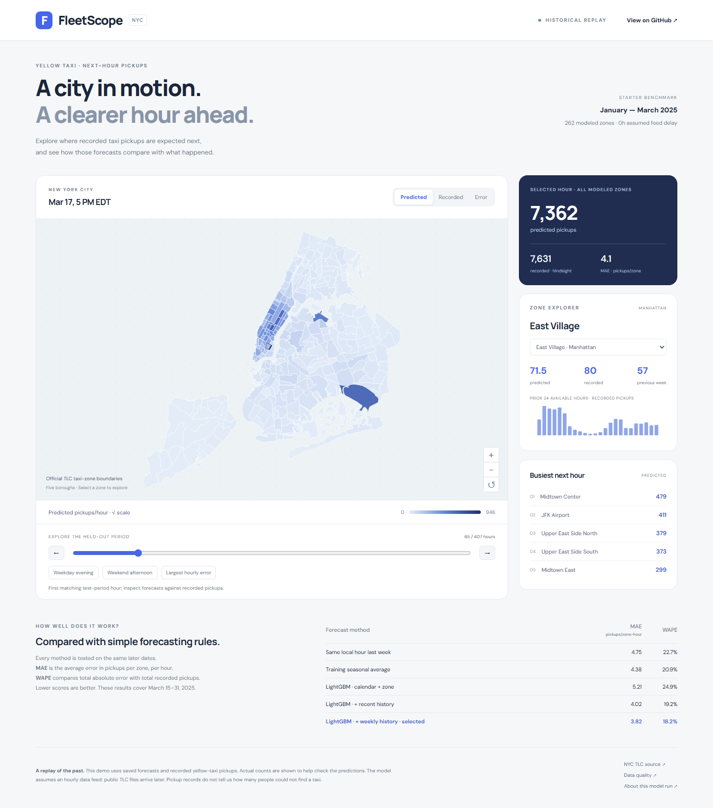
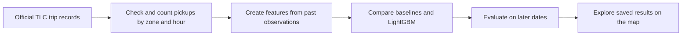

# FleetScope — NYC Taxi Pickup Forecasting

**An interactive machine-learning project that predicts how many yellow-taxi pickups each NYC taxi zone will record in the next hour.**

[Open the live demo](https://nadnaps001.github.io/fleetscope/) · [Read the results](docs/first_results.md) · [Setup and technical guide](docs/technical_guide.md)



## The idea

Taxi activity changes throughout the day. A busy area at lunchtime may look very different late at night. FleetScope uses past pickup patterns to estimate what the next hour might look like.

The dashboard lets you move through historical hours, click a taxi zone, and compare the model's prediction with the number of pickups that actually happened. It also shows where the model made larger mistakes.

This is a student portfolio project built around public data, reproducible experiments, and clear explanations. The demo replays March 2025; it is not a live taxi service.

## Try it in one minute

1. Open the [live demo](https://nadnaps001.github.io/fleetscope/).
2. Use the time slider or choose a weekday, weekend, or difficult example.
3. Click a zone to see its forecast and recent pickup history.
4. Switch between **Predicted**, **Recorded**, and **Error** to compare the results.

The hosted demo uses saved predictions from the evaluated model. It runs entirely in the browser, so visitors do not need an account, Python, or an API key.

## What is built

- A data pipeline that downloads and checks official NYC TLC records.
- Hourly pickup counts for **262 taxi zones** across the five boroughs.
- Two simple forecasting rules used as baselines, plus a LightGBM model.
- Tests that check the model cannot use future pickup information.
- An interactive map with a time slider, zone details, history charts, and error views.
- A FastAPI backend for local use, and a static version hosted on GitHub Pages.
- Automated tests and a deployment workflow that checks the project before publishing.

## Results

The initial experiment uses **11.2 million trip records from January–March 2025**. The model learns from earlier dates and is evaluated on later dates it was not trained on.

| Method | Average error, MAE ↓ | Volume-weighted error, WAPE ↓ |
| --- | ---: | ---: |
| Same local hour last week | 4.75 pickups | 22.66% |
| Historical weekday-and-hour average | 4.38 pickups | 20.91% |
| LightGBM with recent and weekly history | **3.82 pickups** | **18.22%** |

These scores cover **March 15–31, 2025**, using the same 106,634 eligible zone-hours for every method. This experiment assumes the previous hour's pickup count is available immediately.

- **MAE** means the average size of a prediction error for one zone during one hour. A score of 3.82 means an average error of about four pickups.
- **WAPE** is total absolute prediction error divided by total recorded pickups. It is an error measure, not an accuracy percentage.
- The selected model reduces MAE by **12.88%** compared with the baseline chosen on validation data.

### What stood out

Recent information matters. When pickup observations were delayed by two hours, the model's MAE rose from **3.82 to 4.38**, leaving very little improvement over the seasonal baseline. That is a useful result: a forecasting model depends on the quality and timeliness of its inputs.

See the [results report](docs/first_results.md) for the full comparison, feature experiments, and data-quality notes.

## How it works



The main inputs are the zone, hour, weekday, holiday flag, and pickup counts from earlier hours and weeks. All zones from the same hour stay together when splitting the data.

| Part | Tools |
| --- | --- |
| Data preparation | Python, DuckDB, pandas, Parquet |
| Forecasting | LightGBM, scikit-learn |
| Local API | FastAPI |
| Dashboard | JavaScript, HTML, CSS, SVG |
| Testing and hosting | pytest, Ruff, GitHub Actions, GitHub Pages |

## Run it yourself

### View the saved demo locally

This only needs Python 3.11 or newer. It does not download trip data or train a model.

```bash
git clone https://github.com/nadnaps001/fleetscope.git
cd fleetscope
python scripts/build_site.py
python -m http.server 8080 --directory _site --bind 127.0.0.1
```

Open **http://127.0.0.1:8080**. Press `Ctrl+C` in the terminal to stop the server.

### Reproduce the machine-learning experiment

Install [uv](https://docs.astral.sh/uv/getting-started/installation/), then run:

```bash
uv sync --frozen --extra dev
uv run --frozen fleetscope build
uv run --frozen fleetscope serve
```

Open **http://127.0.0.1:8000** for the local dashboard or **http://127.0.0.1:8000/docs** for the API. The first build downloads the official files and trains the models. Detailed commands and experiment settings are in the [technical guide](docs/technical_guide.md).

## Important limits

- **Pickups are not total demand.** The records cannot tell us how many people tried and failed to find a taxi.
- **The feed is assumed.** The experiment assumes recent hourly counts are available, while public TLC files are published later.
- **The data covers one quarter; the test covers about two weeks.** These results do not establish performance across a full year of seasons and events.
- **Fleet allocation is planned.** Vehicle repositioning, travel costs, and simulated coverage are not implemented yet.

## Next steps

- Compare fleet-allocation rules under clearly stated vehicle and travel-time assumptions.
- Evaluate across more months and seasons.
- Add prediction ranges and check how often they contain the recorded count.

## Explore the repository

```text
src/fleetscope/     Data pipeline, model evaluation, API, and dashboard
configs/           Experiment settings and date splits
tests/             Data, forecasting, and API checks
demo/              Saved zone-level data used by the hosted demo
scripts/           Export, website build, and results-report tools
docs/              Results, screenshots, setup, and methodology
.github/workflows/ Automated checks and GitHub Pages deployment
```

The raw trip files, local environments, and machine-specific files are excluded from Git. The public demo includes only the zone-level data needed to explore the saved results.

## Data and acknowledgments

Trip records, taxi-zone names, and map boundaries come from the [NYC Taxi & Limousine Commission](https://www.nyc.gov/site/tlc/about/tlc-trip-record-data.page). Field definitions are in the [yellow-taxi data dictionary](https://www.nyc.gov/assets/tlc/downloads/pdf/data_dictionary_trip_records_yellow.pdf).

The [project plan](FleetScope_NYC_Taxi_Demand_Forecasting_Project_Plan.md) records the full scope and future milestones. This project is independent of NYC TLC.
